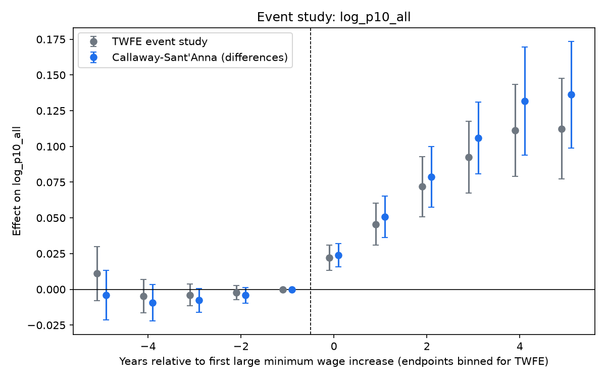
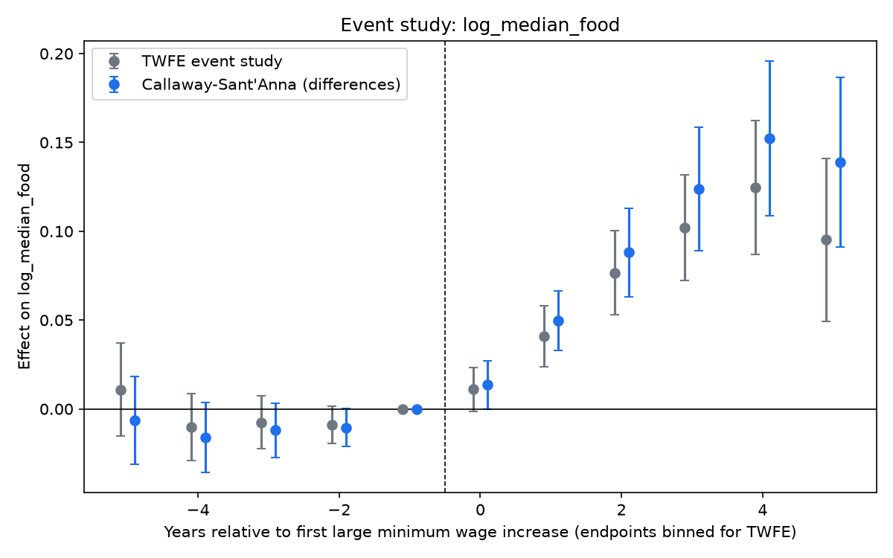
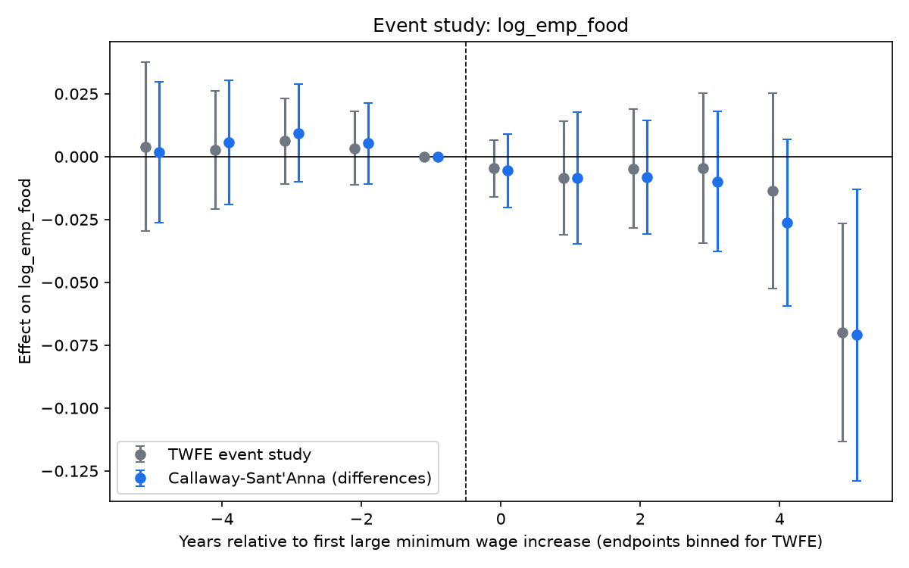
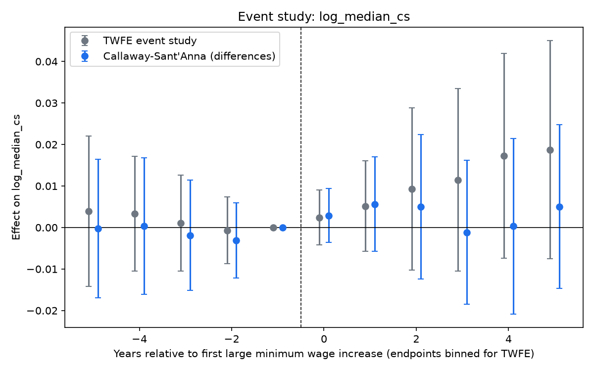
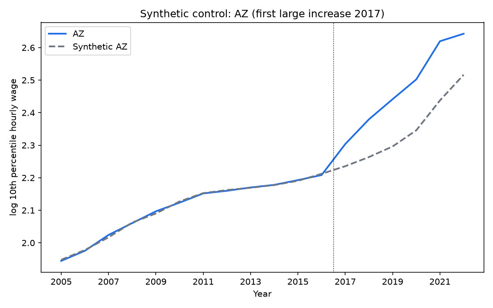
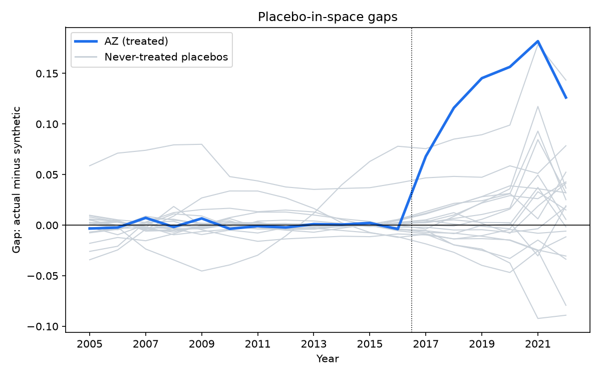
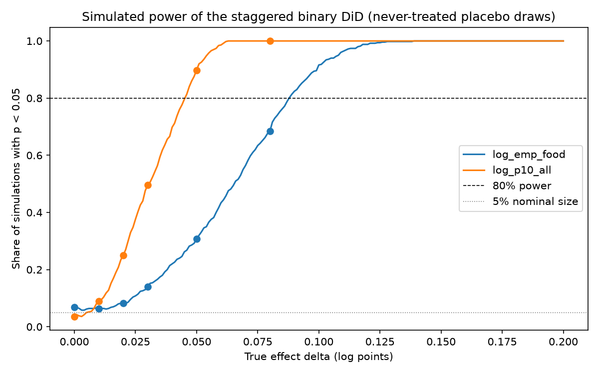

# Results: state minimum wage increases, 2011-2022

_Generated by `python -m causal.report` from `results/*.json`. Do not edit by hand._

## Question

Did state minimum wage increases from 2011 to 2022 raise low-end wages, and did they reduce employment in food service jobs?

## Data and design

State x year panel, 2005-2022, built from BLS OEWS state estimates and the Vaghul and Zipperer (2022) minimum wage series. The event study compares 26 states with a first large increase (at least $0.75 and 8%) in 2011 or later against 20 states that stayed at the federal $7.25. Estimators: continuous two-way fixed effects, a TWFE event study, Callaway and Sant'Anna (2021), and a synthetic control case study. Full details in [docs/METHODS.md](docs/METHODS.md); every judgment call is in [docs/DECISIONS.md](docs/DECISIONS.md).

## Five headline numbers

1. **10th percentile wage, CS overall ATT:** 0.090 log points (about 9.4%), 95% CI [0.068, 0.113], p <0.001
2. **10th percentile wage elasticity to the minimum wage (TWFE):** 0.303, 95% CI [0.243, 0.363]
3. **Food-service employment, CS overall ATT (2005-2022):** -0.034, 95% CI [-0.060, -0.007], p 0.012; pre-COVID (through 2019): -0.005, p 0.619
4. **Synthetic control, AZ 2017:** average post gap 0.132 log points, permutation p 0.048 (rank 1 of 21)
5. **Minimum detectable effect at 80% power, food-service employment:** 0.088 log points

## Headline table

Estimates are in log points. TWFE rows are elasticities with respect to the log effective minimum wage (all 51 units); CS rows are average effects of a large increase (46 units). Standard errors are clustered by state (TWFE) or bootstrapped over states (CS).

| outcome | method | estimate | 95% CI | p-value | N |
|---|---|---|---|---|---|
| log_p10_all | Continuous TWFE elasticity (log MW) | 0.303 | [0.243, 0.363] | <0.001 | 918 |
| log_p10_all | Callaway-Sant'Anna overall ATT | 0.090 | [0.068, 0.113] | <0.001 | 828 |
| log_median_food | Continuous TWFE elasticity (log MW) | 0.308 | [0.244, 0.373] | <0.001 | 918 |
| log_median_food | Callaway-Sant'Anna overall ATT | 0.090 | [0.061, 0.119] | <0.001 | 828 |
| log_emp_food | Continuous TWFE elasticity (log MW) | -0.071 | [-0.175, 0.032] | 0.171 | 918 |
| log_emp_food | Callaway-Sant'Anna overall ATT | -0.034 | [-0.060, -0.007] | 0.012 | 828 |
| log_median_cs | Continuous TWFE elasticity (log MW) | 0.051 | [0.002, 0.101] | 0.041 | 918 |
| log_median_cs | Callaway-Sant'Anna overall ATT | 0.004 | [-0.009, 0.017] | 0.587 | 828 |
| log_p10_all | Synthetic control, AZ average post-period gap | 0.132 | permutation test | 0.048 | 18 |

## Robustness (continuous TWFE)

| outcome | specification | estimate | 95% CI | p-value | N |
|---|---|---|---|---|---|
| log_p10_all | baseline | 0.303 | [0.243, 0.363] | <0.001 | 918 |
| log_p10_all | division_x_year_fe | 0.243 | [0.186, 0.301] | <0.001 | 918 |
| log_p10_all | lag1 | 0.348 | [0.285, 0.411] | <0.001 | 867 |
| log_p10_all | lag2 | 0.352 | [0.289, 0.416] | <0.001 | 816 |
| log_median_food | baseline | 0.308 | [0.244, 0.373] | <0.001 | 918 |
| log_median_food | division_x_year_fe | 0.241 | [0.170, 0.313] | <0.001 | 918 |
| log_median_food | lag1 | 0.367 | [0.298, 0.435] | <0.001 | 867 |
| log_median_food | lag2 | 0.373 | [0.300, 0.445] | <0.001 | 816 |
| log_emp_food | baseline | -0.071 | [-0.175, 0.032] | 0.171 | 918 |
| log_emp_food | division_x_year_fe | -0.056 | [-0.151, 0.039] | 0.241 | 918 |
| log_emp_food | lag1 | -0.095 | [-0.204, 0.013] | 0.082 | 867 |
| log_emp_food | lag2 | -0.108 | [-0.223, 0.008] | 0.066 | 816 |
| log_emp_food | control_log_emp_all | -0.082 | [-0.140, -0.024] | 0.007 | 918 |
| log_median_cs | baseline | 0.051 | [0.002, 0.101] | 0.041 | 918 |
| log_median_cs | division_x_year_fe | 0.027 | [-0.029, 0.083] | 0.331 | 918 |
| log_median_cs | lag1 | 0.056 | [0.008, 0.104] | 0.022 | 867 |
| log_median_cs | lag2 | 0.052 | [0.005, 0.099] | 0.031 | 816 |

## Robustness (event-study designs)

| outcome | binary static TWFE | CS overall ATT | CS pre-COVID (through 2019) |
|---|---|---|---|
| log_p10_all | 0.064 (p <0.001) | 0.090 (p <0.001) | 0.070 (p <0.001) |
| log_median_food | 0.063 (p <0.001) | 0.090 (p <0.001) | 0.080 (p <0.001) |
| log_emp_food | -0.021 (p 0.235) | -0.034 (p 0.012) | -0.005 (p 0.619) |
| log_median_cs | 0.007 (p 0.390) | 0.004 (p 0.587) | -0.002 (p 0.739) |

## Event studies

Grey: TWFE event study (endpoints binned). Blue: Callaway and Sant'Anna. Event time 0 is the first year of the large increase; -1 is the reference year.

### 10th pct hourly wage, all occupations (`log_p10_all`)

### Median hourly wage, food prep and serving (`log_median_food`)

### Employment, food prep and serving (`log_emp_food`)

### Median hourly wage, computer and math (placebo) (`log_median_cs`)

## Pre-trend tests

Joint test that the event-study leads -5 to -2 are zero.

| outcome | TWFE Wald chi-square | TWFE p-value | CS Wald chi-square | CS p-value |
|---|---|---|---|---|
| log_p10_all | 12.351 | 0.015 | 11.530 | 0.021 |
| log_median_food | 17.453 | 0.002 | 18.705 | <0.001 |
| log_emp_food | 4.429 | 0.351 | 4.179 | 0.382 |
| log_median_cs | 1.337 | 0.855 | 1.858 | 0.762 |

## Synthetic control

Case: **AZ**, first large increase in 2017 (+$1.95, 24.2%). Outcome: `log_p10_all`. Donor weights of at least 0.01: PA 0.442, ND 0.163, NH 0.126, TX 0.117, WI 0.116, WY 0.019, LA 0.014.

- Pre-period RMSPE: 0.0036
- Post-period RMSPE: 0.1370
- Post/pre RMSPE ratio: 37.95, rank 1 of 21 units
- Permutation p-value: 0.048 (the smallest possible value with 21 units is 0.048)
- Average post-period gap: 0.132 log points

## Power

500 placebo draws on the 20 never-treated states (11 given fake treatment per draw), binary static TWFE, seed 42.

| outcome | false positive rate (delta = 0) | MDE at 80% power |
|---|---|---|
| log_emp_food | 0.068 | 0.088 |
| log_p10_all | 0.036 | 0.046 |

## Placebo outcome

Computer and math median wages should not respond to the minimum wage.

| method | estimate | 95% CI | p-value |
|---|---|---|---|
| continuous TWFE (baseline) | 0.051 | [0.002, 0.101] | 0.041 |
| continuous TWFE (division_x_year_fe) | 0.027 | [-0.029, 0.083] | 0.331 |
| continuous TWFE (lag1) | 0.056 | [0.008, 0.104] | 0.022 |
| continuous TWFE (lag2) | 0.052 | [0.005, 0.099] | 0.031 |
| Callaway-Sant'Anna overall ATT | 0.004 | [-0.009, 0.017] | 0.587 |
| binary static TWFE | 0.007 | [-0.010, 0.024] | 0.390 |
| Callaway-Sant'Anna overall ATT, pre-COVID | -0.002 | [-0.012, 0.008] | 0.739 |

## Limitations

- **OEWS three-year pooling.** Each OEWS estimate pools six semiannual panels over three years, which smooths changes, biases effects toward zero, and spreads them over several years.
- **State-level aggregation.** Effects are averaged over whole states; local minimum wages (for example in cities) and within-state heterogeneity are not modeled.
- **SOC changes.** Occupation codes were revised in 2010 and 2018. Major groups (00-0000, 35-0000, 15-0000) are used because they are stable, but composition within them can shift.
- **Minimum wage data ends in 2022**, so the panel stops in 2022 and the latest cohorts have only one or two post-treatment years.
- **COVID-19.** 2020-2022 food-service employment moved with state-specific pandemic restrictions, which overlap with the later event times of the early cohorts.
- **Observational design.** States chose to raise their minimums. 10 of the 20 never-treated states are in the Census South, and the CS pre-trend test rejects for log_p10_all, log_median_food, so the estimates rely on assumptions that are only partly testable.

## Plain-English summary

States that made a large minimum wage increase saw their 10th percentile hourly wage rise by about 9.4% relative to states that stayed at $7.25 (Callaway-Sant'Anna ATT 0.090, p <0.001), and the continuous estimate implies a 10% higher minimum wage goes with a 3.0% higher 10th percentile wage. The pre-trend test rejects parallel trends for this outcome (p 0.021), so the size of the wage effect should be treated as approximate, although the largest lead (0.009) is small next to the overall effect and the synthetic control for AZ (permutation p 0.048) points the same way. Food-service employment changes by -0.034 log points over the full 2005-2022 window (p 0.012), but the estimate is -0.005 (p 0.619) when the sample ends in 2019, so the full-sample result depends on the 2020-2022 data, when pandemic restrictions hit food service unevenly across states, and is not robust evidence that the minimum wage changed food-service employment. The design only has 80% power for food employment effects of about 0.088 log points or larger, so smaller job losses or gains cannot be ruled out. The placebo outcome (computer and math wages) shows no effect in the CS design (ATT 0.004, p 0.587), but 3 of 7 placebo estimates are significant at 5%, all from the continuous TWFE; the effect disappears with division-by-year fixed effects (p 0.331), which suggests the baseline TWFE partly picks up regional wage growth.
